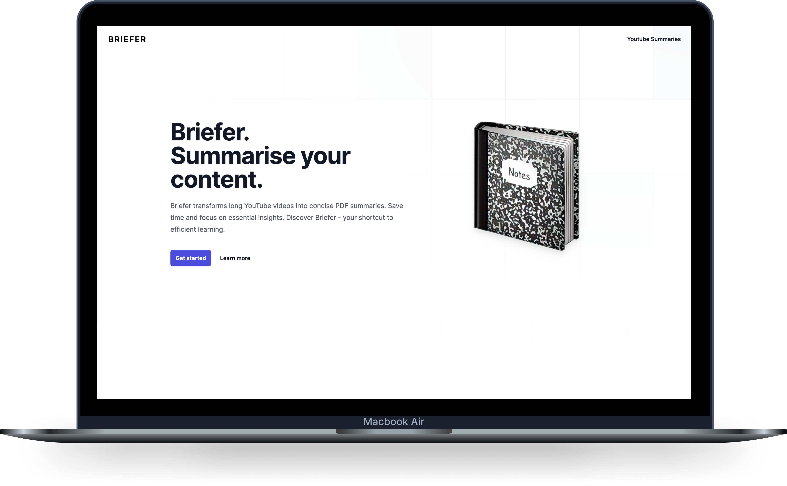
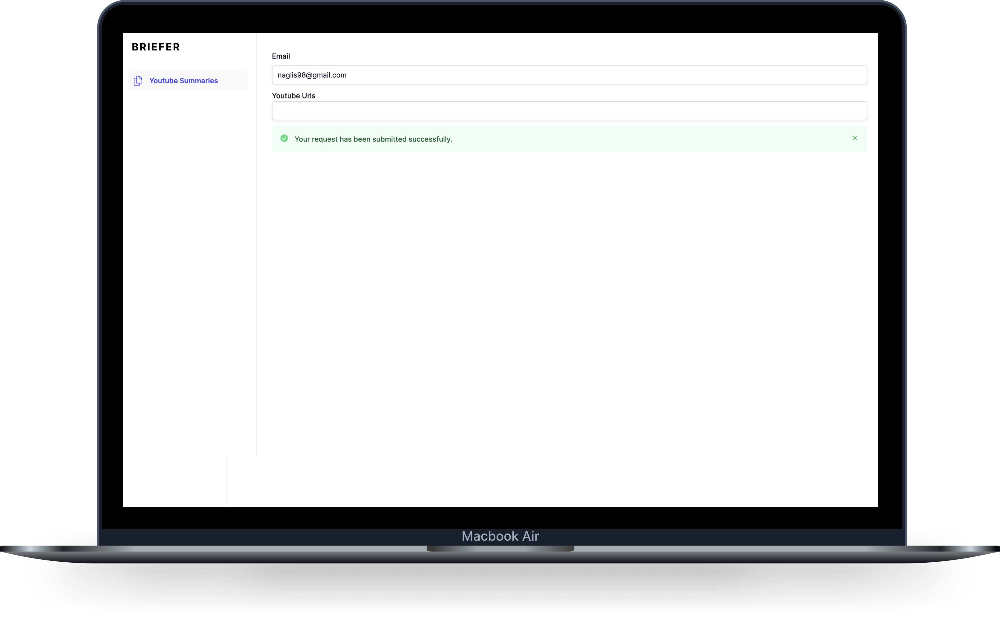

  

## Demo

## Landing Page

</img>

## Dashboard

</img>

## Description

Briefer, leveraging both backend and frontend technologies, is a robust application that transforms YouTube content into accessible, text-based summaries. The backend, powered by NestJS, employs a queue-based architecture for handling various tasks like video download, transcription, and summary creation, while the frontend, designed using Next.js, provides a seamless user interface for collecting and submitting user requests. The harmonious interaction between both ends ensures a streamlined process that delivers video summaries straight to the user's inbox.

## Use cases

Briefer can serve a variety of use cases, thanks to its unique capability of distilling YouTube video content into concise, readable summaries. Some potential applications include:

1. **Educational Content Summarization:** Students and educators alike can use Briefer to summarize educational videos for easier understanding and revision. This allows the extraction of key information and saves significant time that might be spent watching lengthy lectures or tutorials.

2. **Business Meeting Transcriptions:** Companies can use Briefer to transcribe and summarize recorded business meetings or webinars hosted on YouTube. This enables easier reference to key points and decisions, enhancing overall business communication.

3. **Content Creators:** YouTube content creators can utilize Briefer to create text summaries of their videos, providing an additional medium for their audience to engage with their content. This could also aid in creating blog posts, articles, or scripts based on their videos.

4. **Accessibility:** For individuals who prefer reading or have hearing impairments, Briefer can transform video content into a more accessible format. This opens up a broader range of content for these users.

5. **Research and Analysis:** Researchers can use Briefer to collect and analyze data from a range of YouTube videos, saving time on manual transcription and allowing for focus on analysis and insights.

## Extensions

Briefer's functionality extends far beyond its current capabilities, with potential for significant growth and diversification in the future. Here are some promising extension possibilities:

1. **Additional Data Inputs:** Currently, Briefer supports YouTube videos as the primary source of information for generating summaries. However, the system could be extended to incorporate other video platforms like Vimeo or even podcast platforms. This would broaden the range of content that can be summarized and cater to a wider audience.

2. **Extended Summary Services:** Besides videos and podcasts, there's an ocean of written content online which could benefit from summarization. Briefer could be expanded to summarize articles from news platforms, blogs, reviews from sites like Glassdoor, and more. This could significantly enhance the platform's utility, transforming it into a comprehensive tool for content summarization.

3. **Content Listeners:** Briefer could implement listeners that track specific YouTube creators or authors across different platforms. Whenever new content is uploaded or published, Briefer could instantly generate a summary and send it to subscribed users via email. This way, users can stay up-to-date with their favourite creators or authors in a more digestible format.

4. **Specialized Reports:** To cater to diverse user requirements, Briefer could provide specialized summary reports tailored to suit specific use cases. For instance, we could generate analysis reports for professionals in various industries, or summaries of company culture and interview experiences for graduates preparing for job interviews. By offering personalized reports, Briefer can meet a wide range of user needs and preferences.

These extensions hold the potential to elevate Briefer from a simple summarization tool to an all-encompassing platform for handling and distilling diverse content types.
