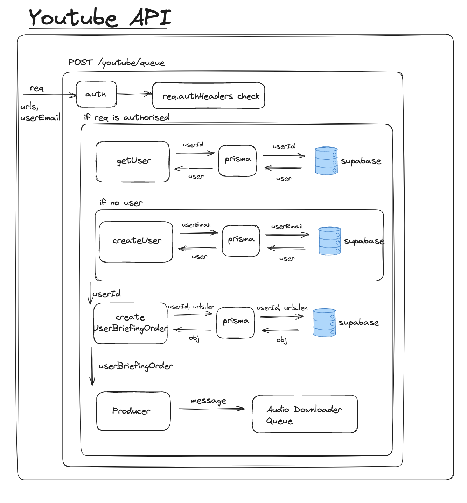

<p align="center">
  <a href="" target="blank"></a>
</p>

## Table of Contents

- [Architecture](#architecture)
  - [Overall Architecture](#overall-architecture)
  - [Youtube Api](#youtube-api)
  - [Queue Processes](#queue-processes)
    - [Audio downloader process](#audio-downloader-process)
    - [Audio to Text Processor](#audio-to-text-processor)
    - [Text Summariser Processor](#text-summariser-processor)
    - [Pdf Generator Processor](#pdf-generator-processor)
    - [Email Sender Processor](#email-sender-processor)
  - [Database](#database)
  - [Services](#services)
    - [**Supabase**](#supabase)
    - [**Upstash**](#upstash)
    - [**Prisma**](#prisma)
    - [**OpenAI**](#openai)
    - [**Mailjet**](#mailjet)
  - [Additional Notes](#additional-notes)
    - [Limitations](#limitations)
    - [Identified Challenges](#identified-challenges)

## Description

Briefer, developed using the NestJS framework, is a web application designed to convert YouTube videos into summarized text briefings.

## Installation

```bash
$ npm install
```

## Running the app

### npm

```bash
# development
$ npm run start

# watch mode
$ npm run start:dev

# production mode
$ npm run start:prod
```

### Docker

Alternatively can run via dockerfile provided, i.e.

```bash
# build
docker build -t nest-cloud-run .

#run with .env variables
docker run -p 3000:3000 --env-file ./.env nest-cloud-run
```

## Configuration

To run application succesfully the following `.env `variables are required:

```bash
DATABASE_URL=
SUPABASE_URL=
SUPABASE_KEY=
REDIS_URL=
YOUTUBE_BUCKET=
OPEN_AI_API_KEY=
MAILJET_API_KEY=
MAILJET_SECRET_KEY=
AUTH_KEY=
REDIS_HOST_URL=
REDIS_HOST_PORT=
REDIS_HOST_PASSWORD=
```

There are more options to configure in the application,
which you are able to observe in `/src/common/configs/config.ts`.

# Architecture

For this application, a queue-based architecture was chosen. Main considerations were:

1. **Scalability**: Queue-based systems scale easily, allowing more workers to process jobs in parallel during peak demand.

2. **Decoupling of Components**: This architecture promotes modularity, as each queue represents a distinct stage in the process that can be modified independently.
3. **Concurrency**: Multiple queues allow for concurrent operation, reducing the overall processing time.
4. **Handling Long Processes**: Queue-based systems are particularly well-suited for handling tasks like downloading audio files, which are inherently time-consuming. By managing these tasks in a queue, our system ensures other operations can continue unimpeded, maintaining overall system performance and responsiveness.

## Overall Architecture

</img>

The Briefer backend is designed to efficiently manage a series of tasks through a queue-based architecture. Here is a conceptual explanation of the workflow as illustrated in the diagram:

1. **API Integration**: The process begins when our API receives a request, which leads to a new message being added to the "Audio Download Queue".

2. **Audio Download Queue**: This queue is responsible for downloading the audio from YouTube videos. Upon successful completion of this task, the audio is then stored securely in our file storage system, and a new job is queued in the "Audio To Text Queue".

3. **Audio To Text Queue**: As the name implies, this queue manages the task of transcribing the audio files into text. Once an audio file is successfully transcribed, a message indicating completion is added to the "Text to Summary Queue".

4. **Text to Summary Queue**: This queue oversees the process of summarizing the transcribed text. Once all the video transcriptions have been summarized, a job is added to the "PDF Generation Queue".

5. **PDF Generation Queue**: The tasks in this queue are focused on generating a PDF document containing the summarized text from the previous step. Once the PDF is successfully created, a message is added to the "Email Queue".

6. **Email Queue**: The final step in the process is managed by the Email Queue. Here, the generated PDF document is emailed to the user as per the request.

## Youtube Api

</img>

## Queue Processes

### Audio downloader process

</img>

### Audio to Text Processor

</img>

### Text Summariser Processor

</img>

### Pdf Generator Processor

</img>

### Email Sender Processor

</img>

## Database

</img>

1. **User**: This model represents a user in the system. Each user has a unique id and email, and can have multiple briefing orders.

2. **UserBriefingOrder**: Represents an order placed by a user. Each order has a unique id, references the user that placed the order, and tracks the total number of videos in the order and how many have been processed so far. An order can contain multiple YouTube videos and an optional BrieferPdfReport.

3. **YoutubeVideo**: This model represents a YouTube video. Each video has a unique id, a unique YouTube id, title, author, and track of times accessed. Each video belongs to a specific UserBriefingOrder and may have associated YoutubeAudioLink, YoutubeTextLink, YoutubeVideoSummary, and BrieferPdfReport.

4. **YoutubeAudioLink**: Represents an audio link extracted from a YouTube video. Each link has a unique id and URL, and references the YouTube video it belongs to.

5. **YoutubeTextLink**: Represents a text link (a link to the transcribed text) related to a YouTube video. Each link has a unique id and URL, and references the YouTube video it belongs to.

6. **YoutubeVideoSummary**: This model contains the summary of a YouTube video. Each summary has a unique id, a summary text, and references the YouTube video it is associated with.

7. **BrieferPdfReport**: This model represents a PDF report generated from a UserBriefingOrder. Each report has a unique id and URL, a file name, a status indicating whether it has been sent, and references the UserBriefingOrder it belongs to. It can be related to multiple YouTube videos.

## Services

Several services power our application, including but not limited to:

### **Supabase**

<p align="left">
  <a href="https://supabase.com/" target="blank"></a>
</p>
We employ Supabase as our primary SQL database and file storage system.

### **Upstash**

<p align="left">
  <a href="https://docs.upstash.com/redis" target="blank"></a>
</p>

Upstash Redis is being used to empower of queues.

### **Prisma**

<p align="left">
  <a href="https://www.prisma.io/" target="blank"></a>
</p>

Prisma serves as our Object-Relational Mapping (ORM) solution.

### **OpenAI**

<p align="left">
  <a href="https://openai.com/blog/openai-api" target="blank"></a>
</p>

We use OpenAI for tasks such as generating text from audio and summarizing text.

### **Mailjet**

<p align="left">
  <a href="https://www.mailjet.com/" target="blank"></a>
</p>

Mailjet facilitates our email communication with users.

## Additional Notes

### Limitations

Given the time constraints, comprehensive testing could not be carried out for the application.

### Identified Challenges

1. **Download Speed:** The `ytdl-core` library utilized for downloading audio can occasionally experience slowed speeds due to YouTube's throttling mechanisms. This may lead to situations where download times are nearly equivalent to the length of the video itself.

2. **Redis and BullMQ Compatibility:** Some compatibility issues have been identified between Upstash Redis and BullMQ, which have resulted in an excessive number of commands being fired to the Redis. This is currently an area of ongoing investigation and optimization.
