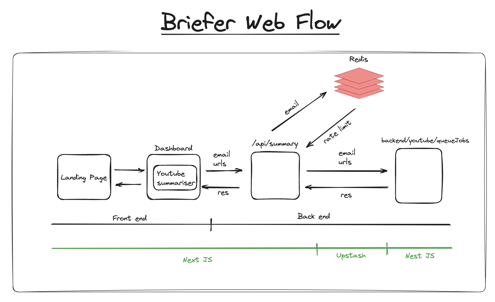

<p align="center">
  <a href="" target="blank"></a>
</p>

## Table of Contents

- [Description](#description)
- [Installation](#installation)
- [Running the App](#running-the-app)
  - [npm](#npm)
- [Configuration](#configuration)
- [Architecture](#architecture)
- [Services](#services)
- [Additional Notes](#additional-notes)
  - [Limitations](#limitations)

## Description

The Briefer frontend, crafted with the Next.js framework, serves as a user-friendly interface that collects and dispatches user requests for YouTube video summarization.

## Installation

```bash
$ npm install
```

## Running the app

### npm

```bash
# development
$ npm run dev

# production mode
$ npm run build && npm run start
```

## Configuration

To run application succesfully the following `.env `variables are required:

```bash
UPSTASH_REDIS_REST_URL=
UPSTASH_REDIS_REST_TOKEN=
BACKEND_ENDPOINT=
```

# Architecture

</img>

The Briefer frontend architecture is designed with user-friendly interactions in mind, facilitating a smooth navigation through its two main components: the Landing Page and the User Dashboard.

1. **Landing Page**: Serving as the initial point of contact, the landing page provides a comprehensive overview of the product. .

2. **User Dashboard:** Transitioning from the Landing Page, the User Dashboard offers an interactive interface for users to input their YouTube URLs and email address. This user input is gathered and then sent to our API route, marking the first step in the request handling process.

3. **Rate Limiting Check**: Once the user input is received, a rate limiting check is performed via a Next.js API route backed by Redis. This mechanism ensures fair system usage by allowing one request per user every 15 minutes. If the check is successful, the user's request proceeds further.

4. **Backend Communication**: Following successful validation, the user's request, containing the YouTube URLs and their email, is dispatched to the backend for processing.

## Services

### **Upstash**

<p align="left">
  <a href="https://docs.upstash.com/redis" target="blank"></a>
</p>

Upstash Redis is being used to empower rate limiting.

## Additional Notes

### Limitations

Given the time constraints, comprehensive testing could not be carried out for the application.
